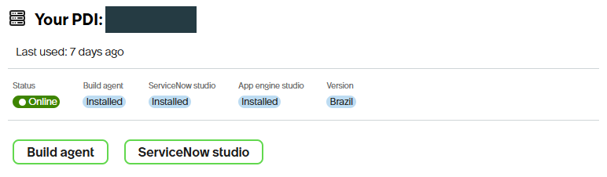

# Connect your Personal Developer Instance (PDI)

After installing ServiceNow Fluent Agent, connect it to your own ServiceNow PDI using **OAuth**. Installation alone does not connect an instance. This is a one-time setup per instance/alias unless the credentials expire or are revoked.

You do not need to create or deploy an application to connect.

## Quick start: ask the agent

1. Finish the installation's terminal checks, then reload VS Code.
2. Start a **new chat** and select **ServiceNow Fluent**.
3. Send this prompt:

   > Help me connect my PDI using OAuth. Ask me for its instance URL and a new credential alias, guide me through browser sign-in, and verify access with a read-only request. Do not deploy anything.

Give the agent your **instance URL** and a short **alias** such as `my-pdi`. Complete sign-in yourself. **Never paste your password, authorization code or access token into chat, an issue or a screenshot.**

Prefer doing it yourself? Follow the steps below.

## 1. Find your PDI and make sure it is awake

Open the [ServiceNow Developer Portal](https://developer.servicenow.com/), sign in, and choose **Manage my instance**. If you do not have a PDI yet, request one through the portal first; availability and button labels can vary.


*The instance controls are in the Developer Portal navigation.*

Check the **Your PDI** card. Wait until the instance is **Online**. Open your instance and copy its **base HTTPS URL**, ending in `.service-now.com`. Do not copy a long page URL containing `/now/`, `/nav_to.do` or query parameters.



*Example of an online PDI. The name is redacted; your release and installed applications may differ. You do not need Build Agent for this guide.*

Make sure you can sign in to that instance in a browser. Your **Developer Portal account and PDI login are different**; use the instance credentials provided through the portal, or the sign-in method configured for that instance.

## 2. Open the correct VS Code terminal

Open your working folder in VS Code. If you already have a now-sdk project, use its project root.

1. Open the Command Palette with **Ctrl+Shift+P**.
2. Choose **Terminal: Create New Terminal (With Profile)**.
3. Select **PowerShell with now-sdk**. Use a new terminal, not one left open from before installation.
4. Check the SDK:

   ```powershell
   Get-Command now-sdk | Select-Object CommandType, Name
   ```

   `CommandType` must be **Function**. If it is not, stop and see troubleshooting below.

   ```powershell
   now-sdk --version
   ```

   Expect a version number without an error. Do not use `now-sdk.cmd` or reinstall the SDK just to repair an old terminal.

## 3. Add your instance using OAuth

An **alias** is a local name for saved credentials, not a ServiceNow username. Choose a new, unique alias. **Adding credentials makes that alias the SDK default; reusing an alias replaces its saved credentials.**

To see existing alias names before choosing one:

```powershell
now-sdk auth --list
```

Then run these commands in the same terminal. Enter your real base URL and chosen alias when prompted:

```powershell
$Instance = Read-Host 'Paste your PDI base HTTPS URL'
$Alias = Read-Host 'Choose a new credential alias'
now-sdk auth --add $Instance --type oauth --alias $Alias
```

Leave the terminal open. The SDK opens a browser for authentication. If it cannot open the browser automatically, use the authorization URL it prints **locally**; do not share that URL.

## 4. Complete browser sign-in and return the code

1. Check that the browser is showing **your intended instance**.
2. Sign in to the PDI. Complete MFA or SSO if requested.
3. Review the OAuth consent request and approve it only if the instance/account are correct. The approval button may say **Accept**.
4. The browser displays an authorization code. Copy it yourself.
5. Return to the waiting VS Code terminal. At **“Copy the code from the browser and paste it here:”**, paste the code and press **Enter**. Input is concealed; it may not appear as readable text.
6. Wait for the SDK command to finish. If it reports an error, do not assume credentials were saved.

Do not send the code to the agent or save it in the project. The interactive SDK flow uses PKCE and the instance's SDK OAuth support; you do not need to invent a client secret or create an Application Registry record for this normal flow. Credentials are stored through the operating system's credential store.

## 5. Verify the connection

First check that the alias is listed:

```powershell
now-sdk auth --list
```

**A listed alias proves only that credentials are configured—not that the instance is reachable.** Ask the agent:

> Verify my PDI connection using the alias and URL I provided. Make one small, read-only REST request. Do not install or change anything on the instance.

Or, in the same terminal where you set `$Instance` and `$Alias`, run the installed REST helper:

```powershell
$ErrorActionPreference = 'Stop'
$SnRest = Join-Path $env:USERPROFILE '.agents\skills\sn-rest\sn-rest.js'
node "$SnRest" --alias $Alias --instance $Instance '/api/now/table/sys_user?sysparm_limit=1&sysparm_fields=user_name'
Write-Output "connection-check-exit=$LASTEXITCODE"
```

A successful JSON response and exit code **0** confirm an authenticated read. A `user_name` result belongs to the returned row; it is **not proof of which account authenticated**. A 403 means the requested operation was denied, not necessarily that sign-in failed.

If you opened a new terminal, re-enter the two values with `Read-Host` first. Do not substitute an unrelated default alias. Do not use `install --info` as a connection test: it does not verify live access.

## You are ready

You can now ask the agent to inspect your PDI or help create an application. Connecting does **not** authorize deployment or record changes; review and approve those separately.

To switch the SDK default later, use `now-sdk auth --use` with the alias you want. Keep using an explicit alias when working with multiple instances.

## Troubleshooting

| What you see | What to do |
| --- | --- |
| PDI sleeping or unavailable | Wake it in the Developer Portal and wait until you can open it normally. |
| `now-sdk` missing or not a Function | Open a new **PowerShell with now-sdk** terminal. If the profile is missing, ask the agent to review terminal setup; do not change execution policy or try batch shims. |
| Browser does not open | Open the authorization URL printed by the waiting SDK command yourself. Keep it private. |
| Wrong instance/account or expired code | Cancel the pending sign-in, confirm the target, then start a new authorization attempt. Do not reuse an old code. |
| Invalid OAuth client or missing SDK callback page | Ask the instance administrator to check the supported IDE/SDK OAuth prerequisites. Do not create secrets or disable security controls as a workaround. |
| HTTP 401 during verification | Confirm the exact alias/instance and reauthorize that connection if its credentials are expired or rejected. |
| HTTP 403 during verification | Request an authorized review of the denied table/operation. Do not grant broad roles or switch identities just to pass the test. |
| Command output is blank or interrupted | Check whether the original command is still waiting/running before retrying. Blank output is not a successful connection. |

## About this guide

Commands and manual code-return behavior were checked against the installed **now-sdk 4.13.6** help/source. Instance login and consent screens vary; this documentation task did not perform a new OAuth sign-in.

The two screenshots are actual Developer Portal captures from **2026-10-07**, cropped to exclude account/browser details. The instance name is masked. No password, authorization code, token or authorization URL is included.

[Back to the installation instructions](../README.md#agent-assisted-setup) · [Agent authentication reference](../payload/.agents/skills/sn-auth/SKILL.md)
