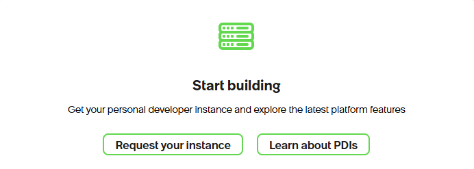

# Connect your Personal Developer Instance (PDI)

After installing ServiceNow Fluent Agent, **log in to your PDI first**, then run one command yourself in a **new VS Code terminal**. The SDK will guide you through the connection. No application creation or deployment is required.

## 1. Log in to your PDI first

Open the [ServiceNow Developer Portal](https://developer.servicenow.com/) and sign in.

**Don't have an instance yet?** If you see the screen below, click **Request your instance**, wait until the instance is available, then click **Start building**.



**Already have an instance?** Click **Start Building** at the top right:


Or click **ServiceNow studio** or **Build Agent** on your PDI card:


These buttons open your PDI and **automatically log you in**. Keep the PDI browser tab open, then continue below.

Note your instance name from its address. For example, an address of `https://dev123456.service-now.com` has the instance name `dev123456`. This is an example—use your own instance.

## 2. Open a new VS Code terminal

In the VS Code menu, choose **Terminal -> New Terminal**.

Run the command below in that new terminal, not one left open from before installation.

## 3. Run the connection command yourself

Replace `dev123456` with your own instance name:

```powershell
now-sdk auth --add dev123456
```

Follow the feedback and prompts provided by the SDK:

- Choose **oauth** when asked for the authentication type.
- Choose a new, recognizable credential alias, such as `my-pdi`. Adding credentials makes that alias the default; reusing an alias replaces its saved credentials.
- In the browser, confirm the instance/account and approve the OAuth request. If a different browser profile opens, sign in to the same PDI there too.
- If asked to copy a code from the browser, paste it **only into the waiting terminal**, then press **Enter**. Input may be concealed.
- Wait for the command to finish and read its result. If it reports an error, do not assume the connection was saved.

**Never paste passwords, authorization codes or tokens into agent chat, an issue or a screenshot.** You do not need to ask the agent to run this command or create a client secret.

When the SDK confirms that credentials have been saved, you can start using the agent with that instance. Individual operations still depend on the account's permissions. Connecting does **not** authorize deployments or record changes; review and approve those separately.

## Troubleshooting

| What you see | What to do |
| --- | --- |
| PDI sleeping or unavailable | Wake it in the Developer Portal, wait for Online status, then log in to the PDI first. |
| `now-sdk` not found | Make sure installation finished, then use **Terminal -> New Terminal**. If it still fails, ask for help reviewing the installation; do not change execution policy or try batch shims. |
| Browser does not open | Open the authorization URL printed by the waiting SDK command yourself. Keep it private. |
| Wrong instance/account or expired code | Cancel the pending sign-in, log in to the correct PDI, then start a new attempt. Do not reuse an old code. |
| Invalid OAuth client or missing SDK callback page | Ask the instance administrator to check the supported IDE/SDK OAuth prerequisites. Do not create secrets or disable security controls as a workaround. |
| Command output is blank or interrupted | Check whether the original command is waiting for input or still running before retrying. Blank output is not success. |

## About this guide

Instance-name support and interactive OAuth prompts were checked against **now-sdk 4.13.6** help/source. Browser screens vary; this documentation task did not perform a new OAuth sign-in.

The instance-request screenshot was supplied for this guide. The other two screenshots are actual Developer Portal captures from **2026-10-07**, cropped to exclude account/browser details. The instance name is masked. No password, authorization code, token or authorization URL is included.

[Back to the installation instructions](../README.md#agent-assisted-setup) · [Agent authentication reference](../payload/.agents/skills/sn-auth/SKILL.md)
